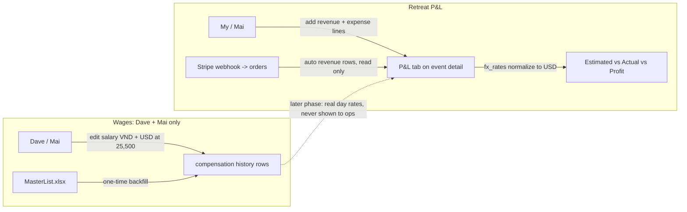

# Infinite Leverage Retreats P&L. 5Ds AI Program Brief

**Date:** 2026-07-24
**Owner:** Dave (sponsor), My and Mai (operations users)
**Format:** A01 5Ds AI Program Brief: Definition of the Problem, Datasources Needed, Diagram and Documented Workflow, ROI Determined, Deployment Plan.
**Decisions locked:** extend the Events module; v1 retreat scope is per-retreat P&L only; staff cost in retreat P&L is a flat $150/day per person; wages are tracked in employee records in both USD and VND at a fixed 25,500 rate, visible and editable by Dave and Mai only.

---

## 1. Definition of the Problem

Operations manages the P&L for Private and Public Infinite Leverage Retreats in a shared Excel workbook. One tab per retreat, hand-typed rate formulas, mixed VND and USD per line, a Summary tab that is not wired to the detail tabs, and Stripe payments reconciled by hand from notes. Retreats are a fast-growing program, with four already booked across August and September, and every new one pulls more of the operations team's time into this manual work; without a repeatable system, that cost climbs with the program. Separately, employee wages live in a standalone spreadsheet (MasterList.xlsx) with no history, no access control, and no system of record.

Problem statement: every retreat's profit is computed by hand in a fragile spreadsheet that scales badly as the program grows, and confidential wage data has no controlled home. We need both inside the admin app, on the existing Events module and employee records, with wage data restricted to Dave and Mai.

Four Outcomes tag: **Cheaper Operations**. The whole return is time saved: up to 20 hours of manual accounting per retreat removed, and a dedicated accounting hire avoided as the program scales. (This is an operations process; the revenue side is the marketing and sale of retreats, a separate workflow.)

---

## 2. Datasources Needed

| Source | Role |
|---|---|
| `Infinite Leverage Retreats - P&L tracking.xlsx` | Historical retreat P&Ls (10 tabs) for backfill; the process being replaced |
| `MasterList.xlsx` (confidential) | Current gross salaries in VND, start dates, contract history for the wage backfill. Values never enter the repo, only the database |
| `company_os.events` | Retreat records already exist (`type='retreat'`): Saigon (completed), Sydney Aug 27, Melbourne Aug 24, Saigon Aug 8 and 9, EO Melbourne Sep 30 |
| `company_os.orders` + `event_registrations` | Stripe revenue for public retreats, already captured by the checkout webhook |
| QuickBooks invoices (synced to `company_os.invoices`) | Private retreat revenue. Bill every private retreat under an **Infinite Leverage** product/service in QBO so all retreat invoices roll up under one program and can be matched to the retreat's P&L |
| `company_os.compensation` | Existing rate table (contractor hourly/billable today); extended to hold salary history |
| `company_os.people` | Employee records the wage section hangs off |
| `company_os.fx_rates` + `lib/admin/fx.ts` | USD normalization for retreat P&L lines (live rate convention) |
| Fixed rate **25,500 VND/USD** | Wage conversion only. Stored as a constant, not fetched |
| Entered each use | P&L line items (description, classification, estimated, actual, currency, payment status); wage changes (new salary, effective date, reason) |

---

## 3. Diagram and Documented Workflow

### Workstream A: retreat P&L on the Events module

**Schema.** New table `company_os.event_pnl_lines`:

- `id`, `event_id` (fk events, cascade), `side` (`revenue` | `expense`)
- `classification`: expense side `accommodation`, `staff_cost`, `venue`, `transportation`, `food_beverage`, `equipment`, `visa`, `commission`, `stripe_fee`, `other`; revenue side `retreat`, `human_tokens`, `mac_mini`, `other` (matches the Summary tab's streams)
- `description`, `person_id` (nullable, staff lines and named clients), `attendees` (nullable, revenue lines)
- `staff_days` (nullable numeric; when set, actual = days x $150 flat v1 rate, overridable)
- `estimated_cents` + `estimated_currency`, `actual_cents` + `actual_currency`, derived `estimated_usd_cents` + `actual_usd_cents` via the existing `fx_rates` / `amount_usd_cents` convention
- `payment_status` (`unpaid`, `to_be_paid`, `paid`), `note`, `sort_order`, timestamps
- Explicit `service_role` grants (new tables are invisible to the app without them)

Do not reuse the `expenses` table: it is QuickBooks-sync territory (`source='qbo'`, `external_id`) and manual retreat lines would pollute reconciliation.

**Revenue side.** Public retreats: Stripe-paid registrations render automatically from `orders` via `event_registrations`, read only, no duplication. Private retreats: revenue is invoiced in QuickBooks under the **Infinite Leverage** product and already syncs into `company_os.invoices`, so v1 enters the retreat's revenue line and reconciles it against the matching QBO invoice (an automatic pull, filtered by the Infinite Leverage item, is a fast-follow). Manual lines still cover Human Tokens, Mac Mini sales, and any bank transfers. Stripe fees are not captured by the webhook today; v1 uses a manual or estimated fee line.

**UI.** New P&L tab on `/admin/revenue/events/[id]` next to the Revenue tab. Revenue section (auto rows + manual lines by stream), expense section grouped by classification, columns for estimated / actual / difference / payment status, native currency shown, totals in USD, footer with Total Revenue, Total Expenses, Profit/(Loss). One client-owned table component (never pass a stateful shelf through `getRowPreview`). Server actions in `[id]/actions.ts`. Access: existing admins gate.

### Workstream B: confidential wage records

**Storage.** Extend `company_os.compensation` (already has `team_member_id`, `comp_type`, `effective_from/to`, `is_current`, `change_reason`, `approved_by`):

- Add `salary_vnd` (native currency, whole VND) and `salary_usd_cents`. Both stored, both editable. The edit form auto-converts at the fixed **25,500** rate whichever field is typed first, and either value can then be overridden before save.
- Salary rows use `comp_type='salary'`, `pay_period='monthly'`.
- **History is append-only**: a change closes the current row (`effective_to`, `is_current=false`) and inserts a new one. Rows are never updated in place, so the full wage history is preserved with dates, reason, and who approved.

**Access control: Dave and Mai only.** The admins gate alone is not enough (My and Quan are also admins). Add a `can_view_sensitive` boolean to `company_os.admins`, set true for `dave@edge8.ai` and `mai@edge8.ai`. Every sensitive surface checks it server-side (server components and actions; data for non-cleared admins is never fetched, not just hidden):

- Compensation view and edit.
- `people_sensitive` and PII in general (ID images, bank details, personal contacts) moves behind the same flag, per the new policy that PII is seen by Dave and Mai only.
- `compensation` stays excluded from the NL-to-SQL admin assistant's visible schema, same treatment as `people_sensitive`.

**UI.** A Compensation section on the person record in `/admin`, rendered only for cleared admins: current salary (VND and USD side by side), history table (amounts, effective dates, reason, approved by), and an add-change form with the 25,500 auto-convert.

**Backfill.** One-time script imports current gross salaries (VND) from MasterList.xlsx for active staff, effective from each person's start date, USD computed at 25,500. Salary values go straight to the database and never into the repo, logs, or commit messages.

**Leak guard.** Retreat P&L staff lines keep the flat $150/day in v1 precisely so wage data cannot leak to ops through cost lines. A later phase may compute real day rates from salary, but any surface visible to non-cleared admins must only ever show blended or flat rates.

---

## 4. ROI Determined

Baseline: today one person spends **up to 20 hours per retreat** on accounting, entering costs by hand, reconciling Stripe and QuickBooks, converting VND and USD, and retyping the Summary. With four retreats booked for August and September and the program growing, that load compounds. Scaling it as-is would force a dedicated accounting hire, easily **$1,000/month ($12k/year)**. Wage data also currently has zero access control and zero history.

FAST goal: **by 4 weeks after merge, every retreat from Sydney (Aug 27) onward has its P&L maintained entirely in the admin app, and the up-to-20-hours of manual accounting per retreat drops to a couple of hours of light data entry.** Measures:

- Accounting time per retreat: up to 20 hours → roughly 2. Revenue posts automatically from Stripe and QuickBooks, costs are captured live, totals compute, and the Summary is never retyped.
- Avoided cost: no dedicated accounting hire as the program scales, roughly $1,000/month ($12k/year).
- 100% of retreats (6 already in the DB, plus backfilled history) have a live P&L; Summary numbers are computed, not retyped.
- Wage data: 100% of active staff have a salary row with history; access verified restricted to exactly 2 people.

---

## 5. Deployment Plan

Phased, one branch, one PR, Dave merges (work locally, batch PRs). Verification is `npx tsc --noEmit` and `npx next build`; never a dev server.

| Phase | Work | Verification |
|---|---|---|
| 1 | Migration: `event_pnl_lines`, compensation columns (`salary_vnd`, `salary_usd_cents`), `admins.can_view_sensitive`, service_role grants | SQL smoke test: insert/select as service role; grants confirmed |
| 2 | Data layer (`lib/admin/event-pnl.ts`, compensation accessors with the sensitive gate) + server actions | `tsc --noEmit`; gate unit-checked: non-cleared admin gets no data |
| 3 | P&L tab UI on event detail | `tsc` + `next build` |
| 4 | Compensation section on person record (cleared admins only) | `tsc` + `next build`; manual check as My-equivalent shows nothing |
| 5 | Backfills: retreat history from the P&L workbook (private retreats get completed `events` rows), salaries from MasterList at 25,500 | Per-retreat totals match the workbook; salary row count matches active headcount |
| 6 | Handover: My and Mai run the Sydney retreat P&L in the app; workbook marked read-only | First real retreat closed in-app |

First action within 7 days: apply the phase 1 migration and open the branch. The workbook stops being edited the day phase 6 completes.

**Build status (2026-07-24):** Phases 1–4 shipped and merged to main (PRs #380 migration, #381 data layer + sensitive gate, #382 P&L tab, #383 Compensation section). Software is live. Phases 5–6 are operational and handed off — see docs/operations/retreats-pnl-backfill-runbook.md: enter historical P&L and salaries through the live UI (the workbook's totals/staff cells are unsaved formulas, so there is nothing reliable to auto-import), and My & Mai close the Sydney retreat in-app. **One deploy step remains:** set `SENSITIVE_VIEWERS=dave@edge8.ai,mai@edge8.ai` in Vercel so Dave (an env-only admin, not an `admins` row) is cleared for wages/PII; Mai is already flagged in the DB.

### Definition of Done

The program is done when all of the following are true:

1. My and Mai can create, edit, and delete revenue and expense lines on any retreat's P&L tab, with estimated vs actual, VND or USD per line, and USD-normalized totals and profit computed automatically.
2. Stripe-paid registrations appear automatically as read-only revenue rows on public retreats.
3. Staff lines compute at $150/day from person + days, overridable.
4. All historical retreats from the workbook exist as completed events with P&L lines, and each backfilled retreat's totals match the spreadsheet.
5. Every active employee has a current salary row storing both VND and USD (25,500 rate), and every subsequent change creates a new dated row so history is never lost.
6. Compensation and all PII surfaces return data only for `dave@edge8.ai` and `mai@edge8.ai`; verified by loading the surfaces as another admin and confirming no data is fetched. `compensation` is invisible to the NL-to-SQL assistant.
7. No salary value appears in the repo, logs, or commit history.
8. `tsc --noEmit` and `next build` pass; PR reviewed and merged by Dave.
9. One real retreat (Sydney, Aug 27) is closed out entirely in the app and the workbook is retired to read-only.

---

## Out of scope (parking lot)

- Fixed program expenses tab and all-up program P&L.
- Summary dashboard (revenue by stream, participants vs the 100 goal).
- To Buy procurement list.
- QBO reconciliation of retreat expenses; automatic Stripe fee capture.
- Real wage-based retreat costing (needs the leak guard design above).
- Alumni salary history from MasterList's Alumni tab (import if useful later).
