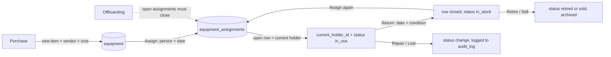

# Equipment Register. 5Ds AI Program Brief

**Date:** 2026-08-05
**Owner:** Dave (sponsor), Operations (register owner, to confirm)
**Format:** A01 5Ds AI Program Brief: Definition of the Problem, Datasources Needed, Diagram and Documented Workflow, ROI Determined, Deployment Plan.
**Home:** Operations > Workplace > Equipment (`/admin/operations/equipment`)
**Branch:** `feat/equipment-tracking` (cut from `main` at 343f292)
**Published:** `/workflows/private/e8/equipment-register`
**Decisions locked:** two tables (item + custody history); status set is `in_use, in_stock, in_repair, lost, retired, sold`; `serial_number` added even though the sheet has none; cost visible to all admins and explicitly outside the wage and PII gate.
**Status:** phases 1 to 4 built and applied. Phases 5 and 6 are operational.

---

## Build status (2026-08-05)

Phases 1 to 4 are shipped: both tables, the two custody RPCs, the admin module,
and the backfill of all 25 items. Three things landed differently from the plan
above, and the plan text below has been left as written so the difference is
visible:

- **27 assignment rows, not 29.** Two of the four handovers have a prior holder
  whose name did not resolve, so only the live period could be recorded.
- **Only one name failed to resolve, not three.** Le Minh Tan, Do Minh Tam and
  Tran Thi Hong Phuong all exist in `company_os.people` after all (the sheet
  writes names without diacritics, the database keeps them). The unresolved ones
  are **Le Dinh Ngoc** (both "Ngoc Le" and "Loc Dinh" are plausible) and
  **Nguyen Duy Khanh Chieu** (a prior holder, near match is a job_seeker). Both
  are noted on the records rather than guessed.
- **Vendors are not linked.** The vendor directory holds cars, tours and venues;
  none of the electronics retailers are in it. Suppliers are kept verbatim in
  `vendor_name_raw` rather than inventing vendor rows as an import side effect.

Verified after import: 25 items, 27 custody periods, 17 open periods matching
17 items in use, holder equal to the open period on every row and zero
mismatches, and 914,033,401 VND on the register, which reconciles to the
spreadsheet exactly.

**Still to do:** phase 5 (physical audit, serial numbers, resolve the two names)
and phase 6 (offboarding closes open assignments).

---

## 1. Definition of the Problem

The company owns 25 tracked items worth **914,033,401 VND (about $35,800)**, and the only record of who holds them is a spreadsheet tab that contradicts itself.

A handover is recorded by overwriting the "Assigned To" cell and pushing the previous holder into an unlabelled column to the right. Four handovers have already happened that way (Jerry to Loi, Chieu to Pham Tieu My, Khoa to Trac, Luan to Ly Doan Van Anh). The next one overwrites the one before it, so custody history is one edit from gone.

The status column has already drifted:

- The "Status" column mixes a tick mark with the words "Currently in use", and the real status often sits in the unlabelled column beside it.
- Seven items are marked in stock, but two of them (Harry's Thinkpad P1, Khang's Macbook M3 Pro) have no return date, so nothing says when they came back or who verified it.
- One item (Le Dinh Ngoc's Macbook Pro M5) has a return date identical to its handover date and a status of "Currently in use".
- Two items have no recorded cost at all.

Nobody can answer "where is that laptop" without walking the office, and nothing connects an employee leaving to the hardware they are holding.

Problem statement: **there is no system of record for company equipment. Custody is overwritten instead of logged, status is unverifiable, and no process returns hardware when someone leaves.** We need the register inside the admin app, on the existing Operations module, with custody as dated history rather than a cell.

Four Outcomes tag: **Cheaper Operations.** The return is hardware not lost and admin time not spent reconstructing who has what.

---

## 2. Datasources Needed

| Source | Role |
|---|---|
| `Tools & Assets Tracking.xlsx`, "Assets & Equipment" tab | 25 equipment rows for the backfill. The process being replaced |
| `company_os.people` | Holders. Every assignment points here. Nicknames in the sheet (Jerry, Ginny, Harry, Ann) stripped before matching |
| `company_os.vendors` | Purchase location. FPT, CellphoneS, Phuong Tin, DiDongViet, T&T Center are already in the directory |
| `company_os.audit_log` | Field level edit history (status flips, cost corrections), so no third history table is needed |
| Entered each use | New purchases, handovers, returns, repairs, serial numbers |
| **Not a source** | The workbook's "Accounts" tab. It holds plaintext passwords and is excluded on purpose. See Out of scope |

**What the sheet does not have:** serial numbers (nowhere in the file), invoice references (column exists, empty on all 25 rows), and USD cost on 16 of 25 rows. VND cost is present on 23 of 25.

---

## 3. Diagram and Documented Workflow

### The rule that makes it work

**One open assignment per item.** The row with `returned_at is null` is the current holder, and `equipment.current_holder_id` mirrors it. Assigning to a new person closes the open row and opens a new one. The previous holder is preserved instead of overwritten, which is the entire failure of the spreadsheet.

### Schema

Two new tables in `company_os`. Nothing equipment shaped exists today: the schema was checked, there is no equipment, assets or devices table. Both follow the `company_os.vendors` conventions: `archived_at` and `archived_by` rather than hard deletes, RLS enabled, and explicit `service_role` grants (new tables are invisible to the app without them).

**`company_os.equipment`**, current state:

| Column | Type | Notes |
|---|---|---|
| `id` | uuid pk | |
| `asset_tag` | text unique | human code, `EQ-0001`, assigned on insert |
| `type` | text not null | `laptop, desktop, monitor, keyboard, mouse, phone, tablet, headset, dock, printer, accessory, other`. Default `other` |
| `name` | text not null | "Macbook Pro 14 M3", "Monitor 27 inch Dell" |
| `brand`, `model` | text | Apple, Lenovo, Dell, Samsung, ASUS. "P1 Gen 6", "E2725H" |
| `serial_number` | text | **not in the spreadsheet**, added blank, filled in at the first audit |
| `processor`, `ram`, `storage`, `screen_size` | text, numeric | nullable. Empty for a mouse or a cable |
| `purchase_date`, `model_year` | date, int | |
| `vendor_id` | uuid fk to `vendors` | purchase location |
| `vendor_name_raw` | text | fallback so an unmatched supplier name is kept, not dropped |
| `invoice_ref` | text | column exists in the sheet, empty on all 25 rows |
| `cost_vnd`, `cost_usd` | numeric | VND on 23 of 25 rows, USD on 9 |
| `status` | text not null | `in_use, in_stock, in_repair, lost, retired, sold`. Default `in_stock` |
| `condition` | text | `new`, `good`, `fair`, `damaged` |
| `current_holder_id` | uuid fk to `people` | denormalised from the open assignment, for list and filter speed |
| `notes` | text | |
| `archived_at`, `archived_by` | timestamptz, text | soft delete, same as vendors |
| `created_at`, `updated_at` | timestamptz | |

**`company_os.equipment_assignments`**, custody history:

`id, equipment_id fk, person_id fk, assigned_at date, returned_at date null, condition_out, condition_in, note, created_by, created_at`

One row per custody period.

### Access

All admins, cost included. Equipment cost is not sensitive and does **not** follow the wage and PII gate that restricts compensation to Dave and Mai.

---

## 4. Admin UI

Mirrors the Vendors module, the current standard for an Operations list (`app/admin/(dashboard)/operations/vendors`).

- **`/admin/operations/equipment`**: PageHead and DataTable with search, sort, pagination, `ArchivedToggle`, and a `FilterBar` on Type and Status. Columns: Item, Type, Assigned to, Status, Purchase date, Cost.
- **`/admin/operations/equipment/new`**: create form.
- **Row shelf**: edit every field, plus two actions.
  - **Assign**: pick a person and a handover date. Closes any open assignment, opens a new one, sets `status` to `in_use` and updates `current_holder_id`.
  - **Return**: sets `returned_at` and condition in, clears the holder, flips `status` to `in_stock`.

  Assignment history renders as a timeline in the shelf. The shelf is a single client owned table, never passed through `getRowPreview`.
- **Sidebar**: Operations > Workplace > Equipment, next to Vendors and Gallery.

---

## 5. ROI Determined

Baseline: **$35,800 of hardware** on the register, average item **39.7M VND (about $1,560)**. Seven items are claimed to be in stock and two of those have no return date, so the true in-stock count is unverified. Four handovers have already overwritten their predecessor. There is no offboarding check, so an unreturned laptop is discovered late or not at all.

The return is not labour hours, it is hardware. **One unreturned laptop costs about $1,560, which is more than this build.** The register's job is to make that impossible to miss.

FAST goal: **within 30 days of go-live, all 25 items have a status verified against the physical device and a serial number recorded, and no employee exits without their open assignments closed.**

Measures:

- 25 of 25 items have a verified status and a serial number (today: 0 serial numbers, 3 items with contradictory status).
- 100% of custody changes recorded as dated assignment rows. The count only grows, it never overwrites.
- Time to answer "who has this laptop": from walking the office to one search.
- Every departure closes its open assignments, checked as part of offboarding.
- Avoided loss: one prevented unreturned machine per year, about $1,560, exceeds the cost of the build.

---

## 6. Deployment Plan

One branch, one PR, Dave merges (work locally, batch PRs). Verification is `npx tsc --noEmit` and `npx next build`, never a dev server.

| Phase | Work | Verification |
|---|---|---|
| 1 | Migration: `equipment`, `equipment_assignments`, indexes, `service_role` grants | SQL smoke test: insert and select as service role, grants confirmed |
| 2 | Data layer (`lib/admin/equipment.ts`, `equipment-shared.ts`) and server actions for assign and return | `tsc --noEmit`. Assign twice in a row leaves exactly one open row |
| 3 | List page, new form, row shelf with the history timeline, sidebar entry | `tsc` + `next build` |
| 4 | Backfill of the 25 rows plus 29 assignment rows, with the name resolution report | Row counts match, four prior holders present, unmatched names reported |
| 5 | Physical audit: walk the office, confirm each status, record serial numbers | 25 of 25 verified, spreadsheet marked read only |
| 6 | Offboarding hook: leaving checklist includes closing open assignments | First departure after go-live closes cleanly |

First action within 7 days of approval: apply the phase 1 migration and open the PR. The spreadsheet stops being edited the day phase 5 completes.

### Rollout and training guide

Ships as `docs/operations/equipment-register-runbook.md` and a training page at `/workflows/private/e8/equipment-register`, matching the Private Retreats and Accounting training guides already in the private library.

**Who does what**

| Role | Responsibility |
|---|---|
| Register owner (Operations) | Adds every purchase, runs the quarterly audit, owns data quality |
| Whoever hands the device over | Records the Assign on the day, not later |
| Offboarding | Closes open assignments before the last working day |
| Everyone | Reports a lost, broken or swapped device to the register owner |

**The four things anyone needs to know**

1. **A new device arrives.** New equipment, fill in type, name, brand, model, serial number, purchase date, vendor and cost. It lands as `in_stock`.
2. **Handing it to someone.** Open the item, Assign, pick the person and the handover date. Status goes to `in_use`. Do this the day it happens, so the date is real.
3. **Getting it back.** Open the item, Return, set the date and the condition it came back in. Status goes to `in_stock` and it is ready to hand out again. Never edit the holder field to "fix" a handover, always Assign or Return, otherwise the history is wrong.
4. **It is broken, lost or finished.** Change the status to `in_repair`, `lost`, `retired` or `sold`. Retired and sold items are archived, not deleted, so the purchase record survives.

**Rollout sequence:** the register owner is trained first and enters the backlog during the phase 5 audit. The team is told once, in writing, that the spreadsheet is closed and equipment questions now go through the app. A quarterly audit keeps the register honest.

### Definition of Done

1. Any admin can create an item, assign it, return it and change its status, and every custody change writes a dated assignment row.
2. Assigning an already assigned item closes the previous period automatically. Two open rows for one item are impossible.
3. All 25 spreadsheet rows exist as equipment, with the four prior holders present as closed assignment periods.
4. Every unmatched person and vendor name has been reported and resolved, not silently dropped.
5. All 25 items have a status verified against the physical device and a serial number recorded.
6. Offboarding includes closing open assignments.
7. `tsc --noEmit` and `next build` pass, PR reviewed and merged by Dave.
8. The spreadsheet tab is read only and the team knows the app is the record.

---

## 7. Verification

No dev server. `npx tsc --noEmit` plus `npx next build`, then a read back query against both tables confirming 25 equipment rows, 29 assignment rows, four closed periods, and the name resolution report. PR with CI green, then checked on production.

---

## Out of scope (parking lot)

- **Tools & Subscriptions tab.** 17 people against 18 SaaS tools, tracking who holds a seat and who pays (self paid, shared company account, client paid, company card). Different shape, and `company_os.subscriptions` already exists as an empty scaffold. The obvious next brief.
- **`/team` self serve view.** "What am I holding, and when did I get it."
- **Depreciation and refresh cycles.** Age is derivable from `purchase_date` once the data is clean.
- **Automatic offboarding enforcement.** Phase 6 is a checklist step, not a system block.
- **The Accounts tab.** It holds plaintext passwords for QuickBooks and TripIt. These are not going into the database, they belong in a password manager, and the credentials that have been sitting in a shared file should be rotated.

## Open items

- **Register owner not yet named.** The runbook needs one.
- **Three assignees may not exist in `company_os.people`:** Le Minh Tan, Do Minh Tam, Tran Thi Hong Phuong. They look like leavers. Every unresolved name is reported back, and those items land with no holder until you say who they map to.
- **Two items have no recorded cost:** a Thinkpad E14 Gen 6 and a Macbook M3 Pro.
